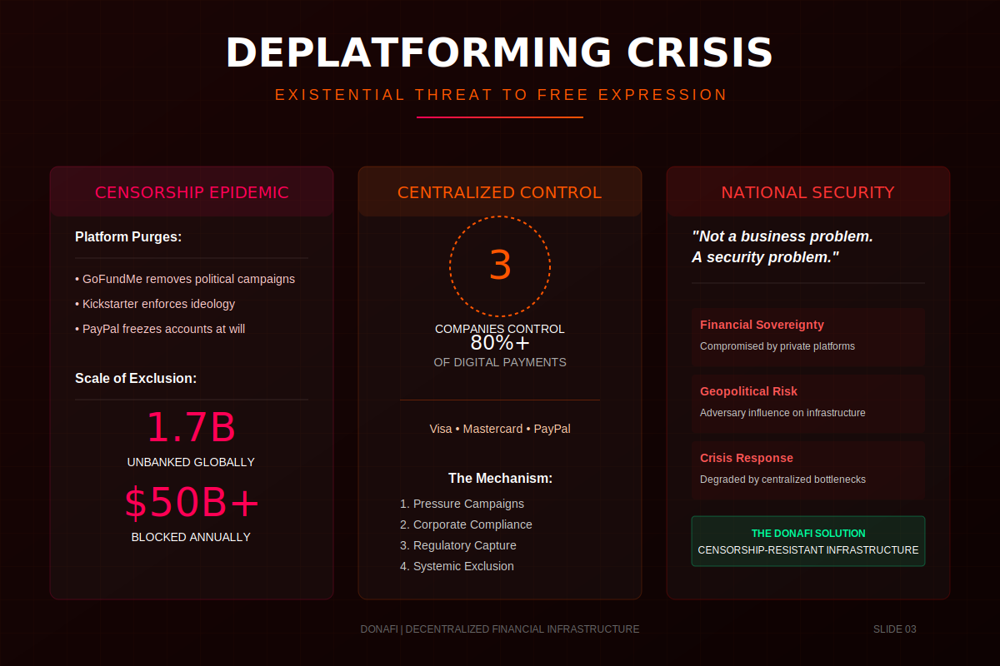

# The Deplatforming Crisis

**Navigation:** [← Previous](./02-executive-summary.md) | [Next: Market Dynamics →](./04-market-dynamics.md)

---

### Abstract

Traditional crowdfunding platforms are failing users through systematic censorship and deplatforming. From political movements to humanitarian aid, centralized intermediaries have become single points of failure, freezing millions in funds and alienating legitimate causes.

This "weaponization of finance" has created massive demand for a neutral alternative. When GoFundMe or PayPal shuts down a legal campaign due to political pressure, they aren't just losing a customer—they are validating the necessity of Donafi.
