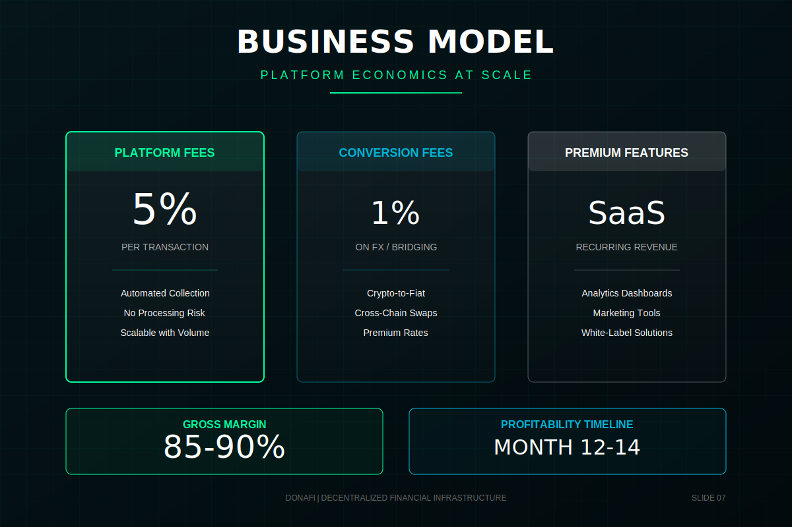

# Business Model

**Navigation:** [← Previous](./06-competitive-landscape.md) | [Next: Go-to-Market →](./08-go-to-market.md)

---

### Abstract

We monetize through a sustainable, value-aligned model: a 5% platform fee on raised funds and optional tipping. This "protocol tax" ensures long-term viability without selling user data or compromising neutrality. As volume grows, our margins expand significantly due to low overhead.

Unlike traditional platforms with bloated compliance departments and banking fees, our decentralized architecture keeps operating costs structurally lower. This allows us to pass savings to users while maintaining healthy margins.
