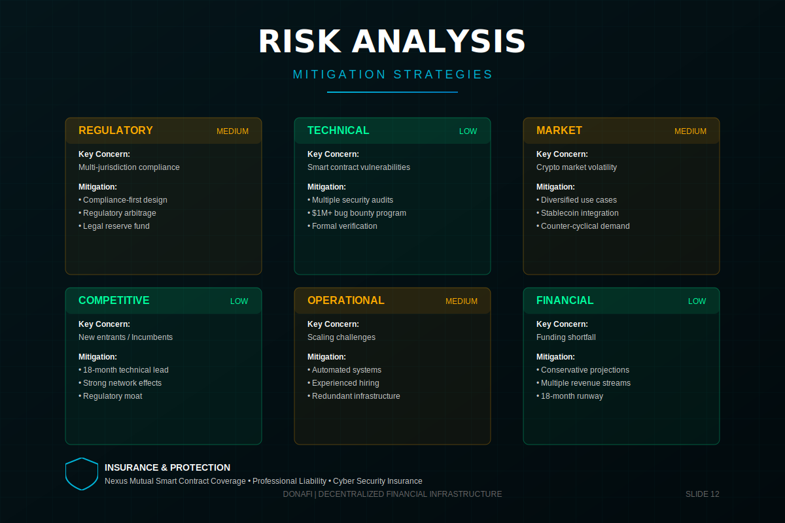

# Risk Analysis

**Navigation:** [← Previous](./11-team-advisors.md) | [Next: The Ask →](./13-the-ask.md)

---

### Abstract

We proactively address risks. Regulatory uncertainty is managed through jurisdictional arbitrage and decentralized governance. Smart contract risk is mitigated by top-tier audits. We turn volatility into a feature, not a bug, by offering stablecoin settlements.

We understand that building censorship-resistant infrastructure attracts scrutiny. Our strategy is to be "antifragile"—designing systems that become more robust when challenged, ensuring long-term survival and success.
