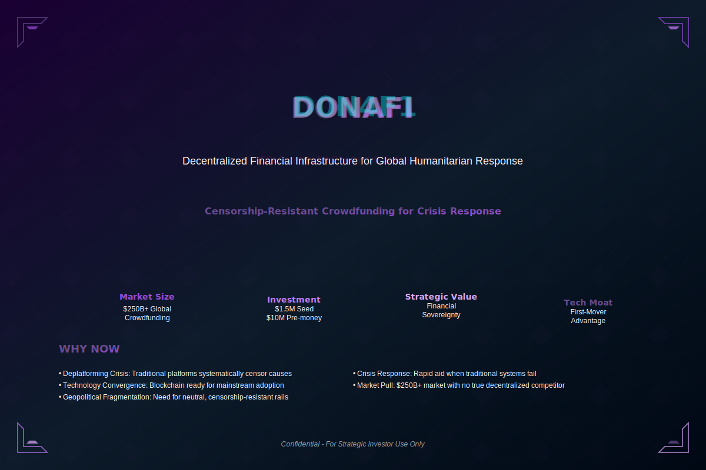

# Donafi: Decentralized Crisis Response

**Navigation:** [Next: Executive Summary →](./02-executive-summary.md)

---

### Abstract

Donafi is building critical financial infrastructure for the next generation of global giving. We are creating the first truly decentralized, censorship-resistant crowdfunding platform that operates beyond the reach of traditional gatekeepers.

This is not just another fintech app. This is democratic financial infrastructure designed to provide rapid crisis response and economic inclusion where traditional systems fail.
