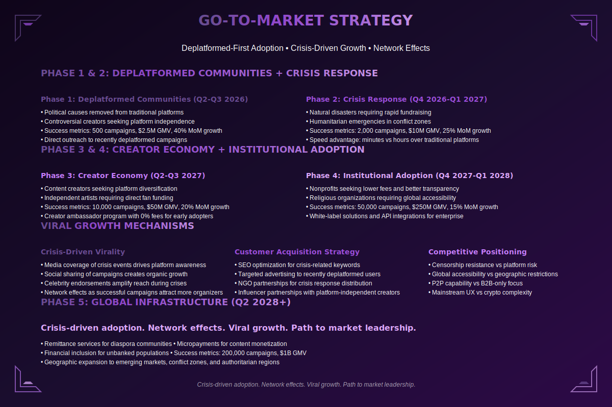

# Go-to-Market Strategy

**Navigation:** [← Previous](./07-business-model.md) | [Next: Financial Projections →](./09-financial-projections.md)

---

### Abstract

Our strategy targets high-need users first: crypto-native communities and deplatformed organizations. We leverage "vampire attacks" on legacy platforms—offering lower fees and censorship resistance—to drive initial adoption, then expand to mainstream users through fiat on-ramps and seamless UX.

We don't just wait for users; we go where the friction is highest. By solving acute pain points for underserved communities, we build a loyal, evangelical user base that drives organic growth and network effects.
