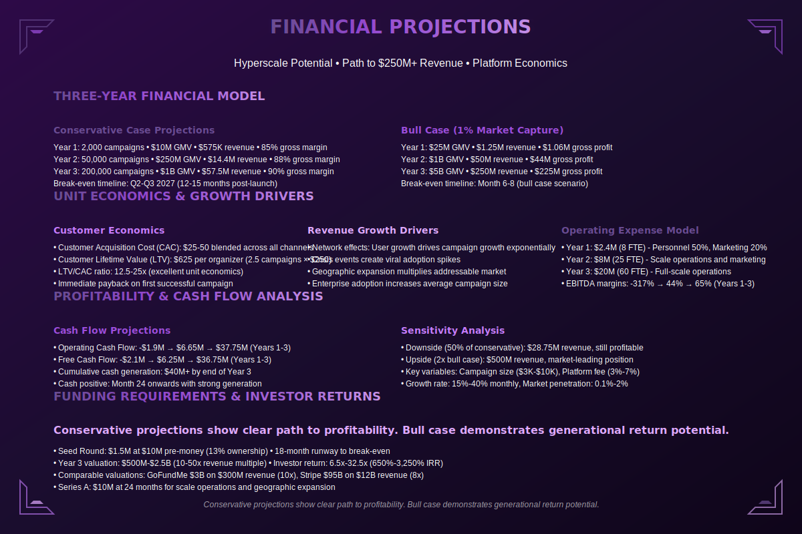

# Financial Projections

**Navigation:** [← Previous](./08-go-to-market.md) | [Next: Technology Roadmap →](./10-technology-roadmap.md)

---

### Abstract

Our projections are grounded in conservative market capture but show explosive potential. We aim for $10M GMV in Year 1, growing to $1B+ by Year 3. With a lean operational structure, we project profitability by Month 14, delivering venture-scale returns on a Seed investment.

Because we are building infrastructure, our unit economics improve with scale. Once the protocol is deployed, the marginal cost of processing an additional million dollars in donations is negligible, creating powerful operating leverage.
